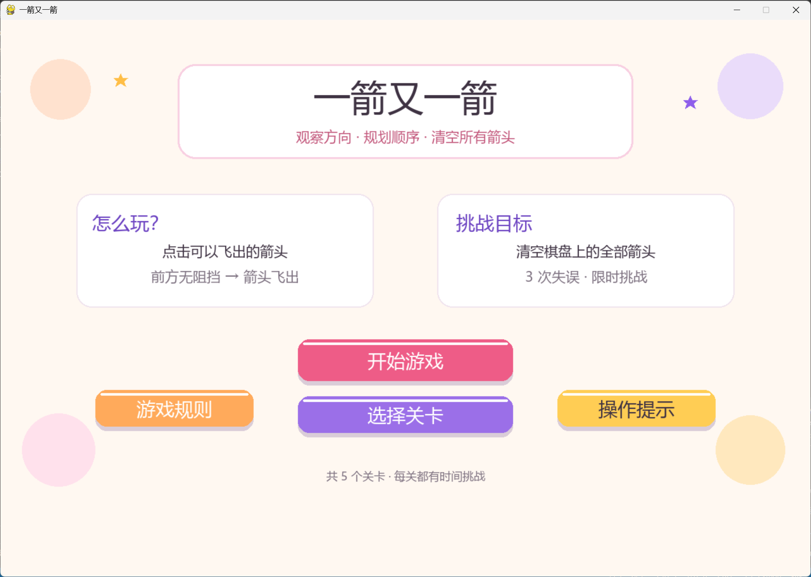
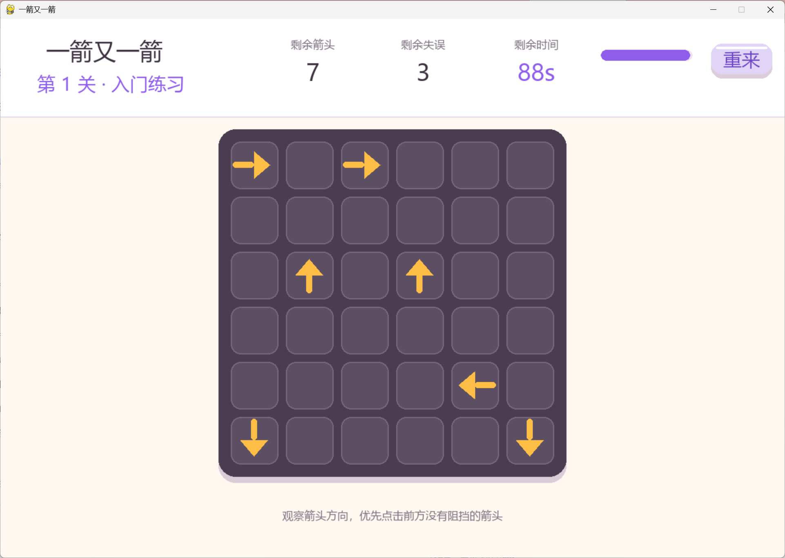
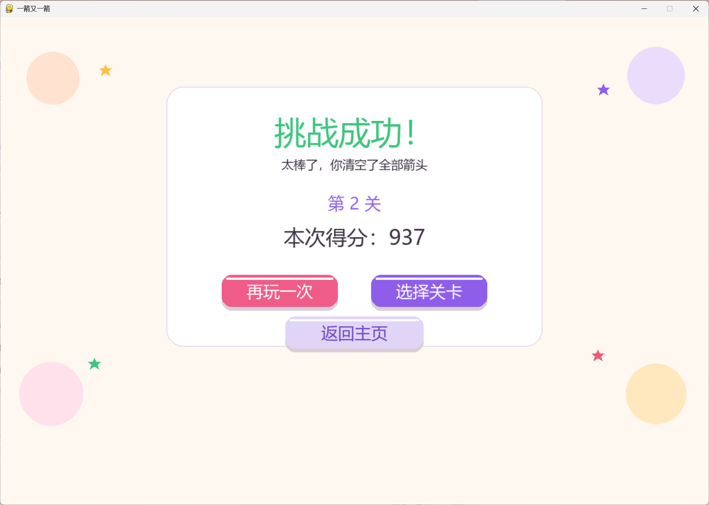
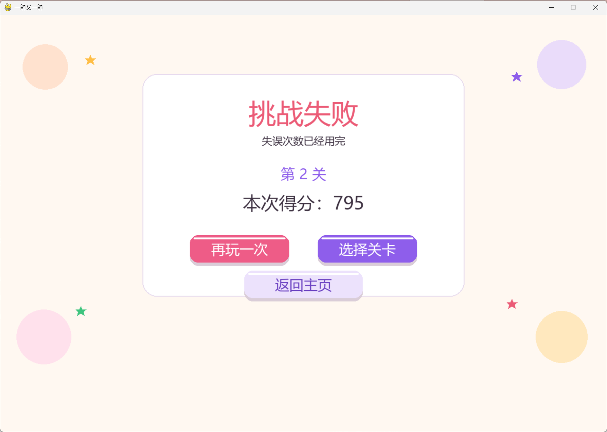

# 一箭又一箭 (Arrow Game)

一款使用 Python + Pygame 开发的益智类点击小游戏，玩家通过观察箭头方向、规划点击顺序，让所有箭头依次飞出棋盘。

---

## 1. 项目名称

**一箭又一箭 (Arrow Game)**


## 2. 游戏简介

游戏棋盘是一个 6×6 的方阵，格子里随机分布着朝向 **上、下、左、右** 四个方向的箭头。

**核心规则：**

1. 点击一个箭头，程序判断该箭头前进方向上是否有其他箭头。
2. 前方没有阻挡 → 箭头飞出棋盘并消失，格子闪烁绿色。
3. 前方有阻挡 → 箭头不能消失，失误次数减 1，格子闪红并伴随棋盘晃动。
4. 清空全部箭头 → 挑战成功。
5. 失误次数耗尽或倒计时结束 → 挑战失败。

游戏共 **5 个关卡**，难度递增，每关都有独立的限时和失误次数限制。

---

## 3. 开发环境

| 项目 | 版本 |
| :--- | :--- |
| 操作系统 | Windows 10 / 11、macOS、Linux |
| Python | 3.8 及以上 |
| Pygame | 2.x |
| 编辑器 | VS Code / PyCharm / Jupyter 均可 |

---

## 4. 安装和运行方法


### 4.1 安装 Pygame

打开终端（Windows 用 PowerShell 或 cmd），执行：

```bash
pip install pygame
```

如果你使用 Anaconda，也可以用：

```bash
conda install -c cogsci pygame
```

### 4.2 运行游戏

进入项目目录，执行：

```bash
python main.py
```

或（Windows 下）：

```bash
py main.py
```

运行后会弹出游戏窗口。

---

## 5. 游戏操作说明

| 操作 | 说明 |
| :--- | :--- |
| 鼠标左键点击箭头 | 尝试让该箭头飞出棋盘 |
| 点击“开始游戏” | 从第 1 关开始挑战 |
| 点击“选择关卡” | 打开关卡选择界面，自由选择 5 个关卡 |
| 点击“重来” | 重新开始当前关卡 |
| 按 `Esc` | 在游戏界面返回主页 |
| 主页按 `Enter` 或 `空格` | 直接开始第 1 关 |

**提示**：优先点击前方没有阻挡的箭头，清完外围后再处理内圈，能有效避免失误。

---

## 6. 项目目录结构

```text
ArrowGame/
├── main.py         # 游戏主循环、状态管理、事件处理
├── config.py       # 常量、颜色、字体加载
├── levels.py       # 5 个关卡数据
├── logic.py        # 路径检测核心算法
├── draw.py         # 箭头、按钮、文字绘制工具
├── board.py        # 棋盘绘制与鼠标定位
├── pages.py        # 首页、选择关卡、帮助、游戏、结果页面
├── README.md       # 项目说明
├── .gitignore      # Git 忽略规则
└── screenshots/    # 游戏截图目录
    ├── home.png
    ├── game.png
    └── result-win.png
    └── result-lose.png
```

---

## 7. 游戏截图

### 7.1 开始界面



开始界面包含游戏标题、玩法说明、挑战目标，以及“开始游戏 / 选择关卡 / 游戏规则 / 操作提示”四个按钮。

### 7.2 游戏界面



顶部状态栏显示剩余箭头数、剩余失误次数、剩余时间和时间进度条，右上角是“重来”按钮，中间是 6×6 棋盘。

### 7.3 通关界面




清空所有箭头后显示“挑战成功！”，并给出本关得分；点击“再玩一次”“选择关卡”“返回主页”可进行下一步操作。


---

## 8. 关键实现说明

### 8.1 方向表示

统一用一个 `DIRS` 列表表示四个方向：

```python
DIRS = [(0, -1), (1, 0), (0, 1), (-1, 0)]
```

索引 `0 / 1 / 2 / 3` 分别对应 **上 / 右 / 下 / 左**，每个元素是一个 `(dx, dy)`，表示沿该方向移动一格时行列的变化量。

### 8.2 关卡数据

每个关卡是一个字典，`arrows` 字段用 `(行, 列, 方向)` 三元组表示每个箭头：

```python
{
    "name": "入门练习", "count": 7, "time": 90,
    "arrows": [(0, 0, 1), (5, 0, 2), (2, 1, 0), ...]
}
```

### 8.3 路径检测

核心逻辑在 `logic.py` 的 `is_clear` 函数中：

```python
def is_clear(r, c, direction, arrow_map):
    dx, dy = DIRS[direction]
    current_c = c + dx
    current_r = r + dy

    while 0 <= current_r < 6 and 0 <= current_c < 6:
        if (current_r, current_c) in arrow_map:
            return False
        current_c += dx
        current_r += dy
    return True
```

从当前箭头出发，沿方向一格一格向外移动，越界前若遇到其他箭头则返回 `False`，否则返回 `True`。

### 8.4 动画与反馈

- **成功飞出**：用 520ms 的三次缓出函数让箭头向外偏移 170 像素，同时透明度递减实现淡出。
- **失败晃动**：棋盘整体偏移由 `math.sin(now / 35) * 5` 控制，产生左右晃动。
- **格子颜色**：成功格子填绿、失败格子填红，持续约 750~800ms。

---

## 9. 开发与提交记录

本项目在开发过程中借助 AIGC 工具（DeepSeek、ChatGPT、Gemini）辅助完成代码框架搭建、关卡设计、Bug 修复与动画优化，并自行试玩验证每个关卡的可解性。

主要 Commit 记录：

```text
chore: 初始化仓库并添加 .gitignore
feat: 搭建游戏窗口配置、颜色常量和字体加载
feat: 定义 5 个可通关的关卡数据
feat: 实现四个方向的路径检测 is_clear
feat: 实现箭头绘制与按钮、文字绘制工具
feat: 实现 6×6 棋盘绘制与鼠标格子定位
feat: 实现首页、选择关卡、帮助、游戏、结果五个页面绘制
feat: 实现游戏主循环、点击处理与状态管理
fix: 修复向上检测时的数组越界
fix: 重新设计第五关，保证可解
docs: 完善 README 和运行说明
docs: 补充博客与测试记录
```

---

## 10. 参考与致谢

- Pygame 官方文档：https://www.pygame.org/docs/
- 字体：Windows 使用“微软雅黑”，macOS 使用“苹方”，Linux 使用“Noto Sans CJK”
- AIGC 工具：DeepSeek、ChatGPT

---
